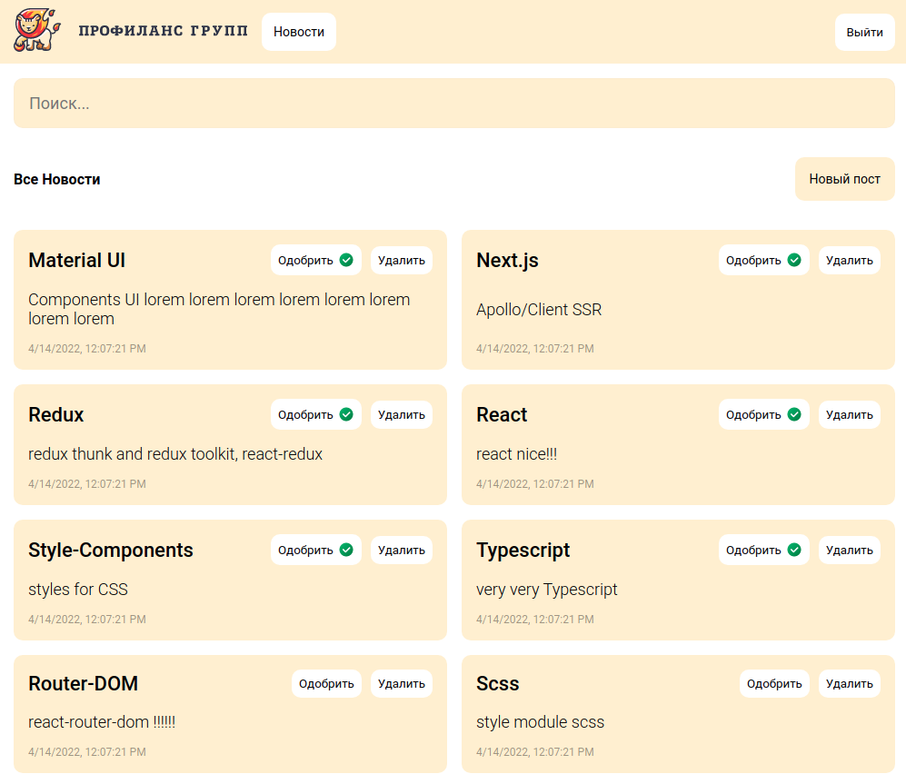
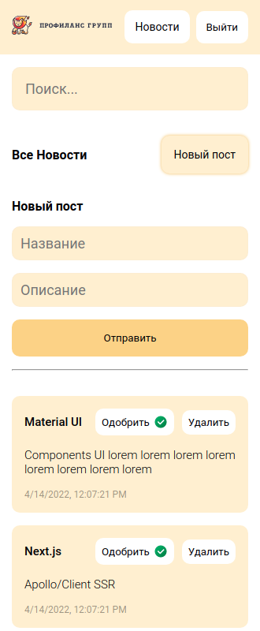

### Тестовое задание для frontend-разработчика

```
- Страница "Главная".
На ней должен быть текст: "Привет, Гость", если пользователь не авторизован и текст "Привет, {LOGIN}", если пользователь авторизован.

-Вход
  Производится на попапе, вводится логин и пароль. При неверном вводе должна быть индикация ошибки. После успешного входа попап закрывается.
-"Новости"
  Отображается список новостей и поиск по новостям. Фильтрация новостей должна производиться сразу при вводе текста поиска. У каждой новости есть: название, текст и дата создания.
```

---

- [Deploy app](https://test-app-seven-gamma.vercel.app/)

```
Должно быть 2 пользователя:
  user: login: User, password: user
  Admin: login: Admin, password: admin
```

#### Десктоп



#### Мobile


